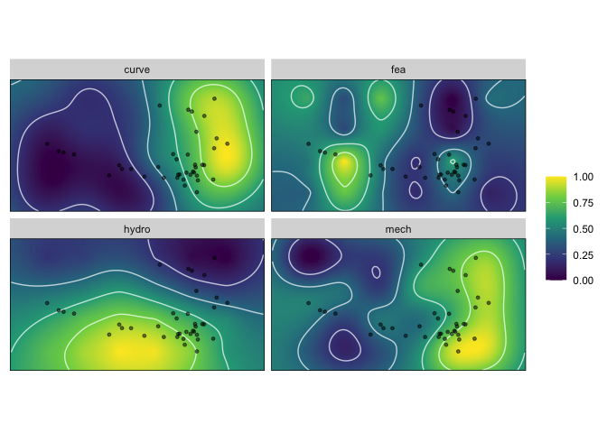
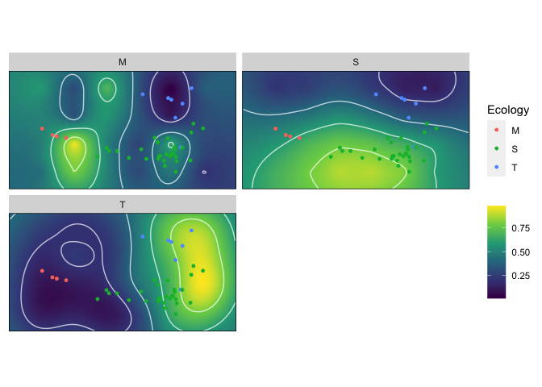

<!-- README.md is generated from README.Rmd. Please edit that file -->

# Morphoscape: An R package for the contruction and analysis of adaptive landscapes

## <!--  -->

`Morphoscape` is a package designed for the constructions, analysis and
visualization of spatially organized trait data into adaptive
landscapes. `Morphoscape` provides a pipeline for combining spatial
coordinate data derived from an ordinated morphospace, such as a PCA,
with performance trait data; and finding ‘optimum’ adaptive landscapes
from the combination of those trait data.

`Morphoscape` does not provide tools for the generation of morphospaces.
For shape analyses and tools to ordinate multivariate phenotypic data,
see the `Geomorph` or `Morpho` packages.

For an in-depth guide on using `Morphoscape`, and some discussion on
morphospace design, see the vignette.

To install `Morphoscape` from GitHub you will need to install the
`devtools` package and run `install_github("blakedickson/Morphoscape")`:

``` r
install.packages("devtools")
devtools::install_github("ngreifer/Morphoscape")
```

The point of entry into `Morphoscape` is a dataframe containing two
columns of XY coordinate data followed by columns containing performance
variables. See the `warps` data object for an example. An additional
dataframe `turtles` with specimen coordinates and grouping variables is
also provided.

``` r
library(Morphoscape)
data('warps')
str(warps)
```

    #> 'data.frame':    24 obs. of  6 variables:
    #>  $ x    : num  -0.189 -0.189 -0.189 -0.189 -0.134 ...
    #>  $ y    : num  -0.05161 -0.00363 0.04435 0.09233 -0.05161 ...
    #>  $ hydro: num  -1839 -1962 -2089 -2371 -1754 ...
    #>  $ curve: num  8.07 6.3 9.7 15.44 10.21 ...
    #>  $ mech : num  0.185 0.193 0.191 0.161 0.171 ...
    #>  $ fea  : num  -0.15516 -0.06215 -0.00435 0.14399 0.28171 ...

``` r
data('turtles')
str(warps)
```

    #> 'data.frame':    24 obs. of  6 variables:
    #>  $ x    : num  -0.189 -0.189 -0.189 -0.189 -0.134 ...
    #>  $ y    : num  -0.05161 -0.00363 0.04435 0.09233 -0.05161 ...
    #>  $ hydro: num  -1839 -1962 -2089 -2371 -1754 ...
    #>  $ curve: num  8.07 6.3 9.7 15.44 10.21 ...
    #>  $ mech : num  0.185 0.193 0.191 0.161 0.171 ...
    #>  $ fea  : num  -0.15516 -0.06215 -0.00435 0.14399 0.28171 ...

This dataframe is input into the `as_fnc_df()` which will coerce
coordinate data into the correct format, and rescale performance
variables to unit range.

``` r
warps_fnc <- as_fnc_df(warps, func.names = c("hydro", "curve", "mech", "fea"))
```

Performance surfaces are calculated using `krige_surf()`, and can be
used to just calculate surfaces, or also predict performance of
`new_data` points.

``` r
kr_surf <- krige_surf(warps_fnc, hull = FALSE, new_data = turtles)
```

    #> [using ordinary kriging]
    #> [using ordinary kriging]
    #> [using ordinary kriging]
    #> [using ordinary kriging]
    #> [using ordinary kriging]
    #> [using ordinary kriging]
    #> [using ordinary kriging]
    #> [using ordinary kriging]

``` r
plot(kr_surf)
```



To calculate adaptive landscapes based on groupings, first a population
of landscapes is generated using `generate_weights()` and
`calc_all_lscps()`:

``` r
weights <- generate_weights(n = 10, data = kr_surf)
all_landscapes <- calc_all_lscps(kr_surf, grid_weights = weights)
all_landscapes
```

    #> An all_lscps object
    #> - functional characteristics:
    #>  hydro, curve, mech, fea
    #> - number of landscapes:
    #>  286
    #> - weights incremented by:
    #>  0.1
    #> - new data:
    #>  40 rows

Optimal landscapes for groups are then calculated using `calcWprimeBy()`
and can be statistically compared using `multi.lands.grp.test()`:

``` r
wprime_by_Group <- calcWprimeBy(all_landscapes, by = ~Ecology)

wprime_by_Group
```

    #> - Ecology == "M"
    #> 
    #> Optimal weights:
    #>       Weight      SE     SD Min. Max.
    #> hydro   0.15 0.06455 0.1291  0.0  0.3
    #> curve   0.00 0.00000 0.0000  0.0  0.0
    #> mech    0.00 0.00000 0.0000  0.0  0.0
    #> fea     0.85 0.06455 0.1291  0.7  1.0
    #> 
    #> Average fitness value at optimal weights:
    #>    Value      SE      SD   Min.   Max.
    #> Z 0.7686 0.01039 0.02078 0.7444 0.7927
    #> -----------------------------------------
    #> - Ecology == "S"
    #> 
    #> Optimal weights:
    #>        Weight      SE      SD Min. Max.
    #> hydro 0.85556 0.02422 0.07265  0.8  1.0
    #> curve 0.05556 0.02422 0.07265  0.0  0.2
    #> mech  0.05556 0.02422 0.07265  0.0  0.2
    #> fea   0.03333 0.01667 0.05000  0.0  0.1
    #> 
    #> Average fitness value at optimal weights:
    #>    Value       SE    SD   Min.   Max.
    #> Z 0.7496 0.005665 0.017 0.7326 0.7835
    #> -----------------------------------------
    #> - Ecology == "T"
    #> 
    #> Optimal weights:
    #>       Weight      SE     SD Min. Max.
    #> hydro   0.00 0.00000 0.0000  0.0  0.0
    #> curve   0.85 0.06455 0.1291  0.7  1.0
    #> mech    0.15 0.06455 0.1291  0.0  0.3
    #> fea     0.00 0.00000 0.0000  0.0  0.0
    #> 
    #> Average fitness value at optimal weights:
    #>    Value       SE      SD  Min.   Max.
    #> Z 0.7646 0.008862 0.01772 0.744 0.7852
    #> 
    #> - method: chi-squared, quantile = 0.05

``` r
summary(wprime_by_Group)
```

    #> Optimal weights by Ecology:
    #>   W_hydro W_curve  W_mech   W_fea       Z
    #> M 0.15000 0.00000 0.00000 0.85000 0.76856
    #> S 0.85556 0.05556 0.05556 0.03333 0.74959
    #> T 0.00000 0.85000 0.15000 0.00000 0.76457

``` r
plot(wprime_by_Group, ncol = 2)
```



``` r
tests <- multi.lands.grp.test(wprime_by_Group)
tests
```

    #> Pairwise landscape group tests
    #> - method: chi-squared | quantile: 0.05
    #> 
    #> Results:
    #>   M S T
    #> M - 0 0
    #> S 0 - 0
    #> T 0 0 -
    #> (lower triangle: p-values | upper triangle: number of matches)
